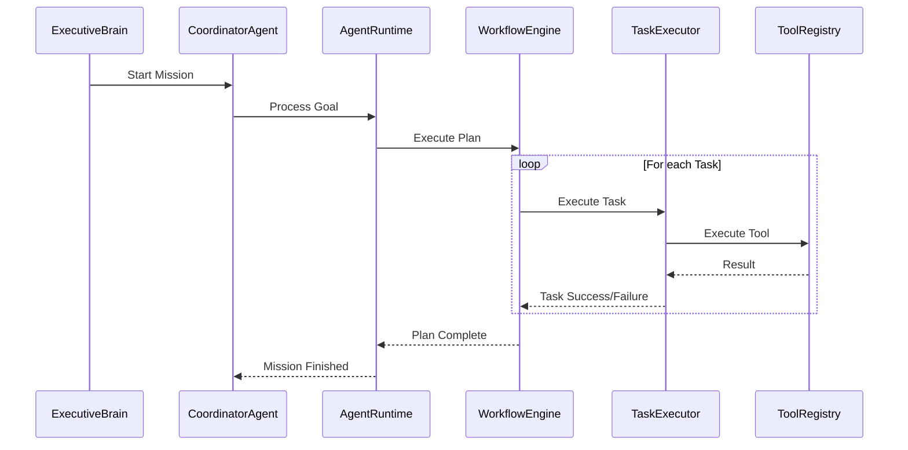
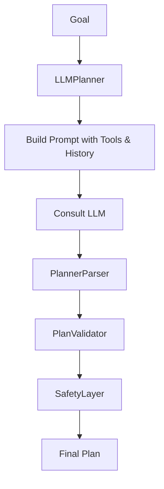
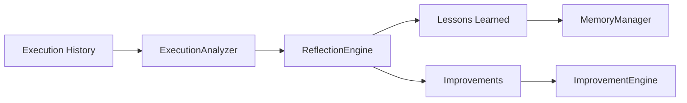
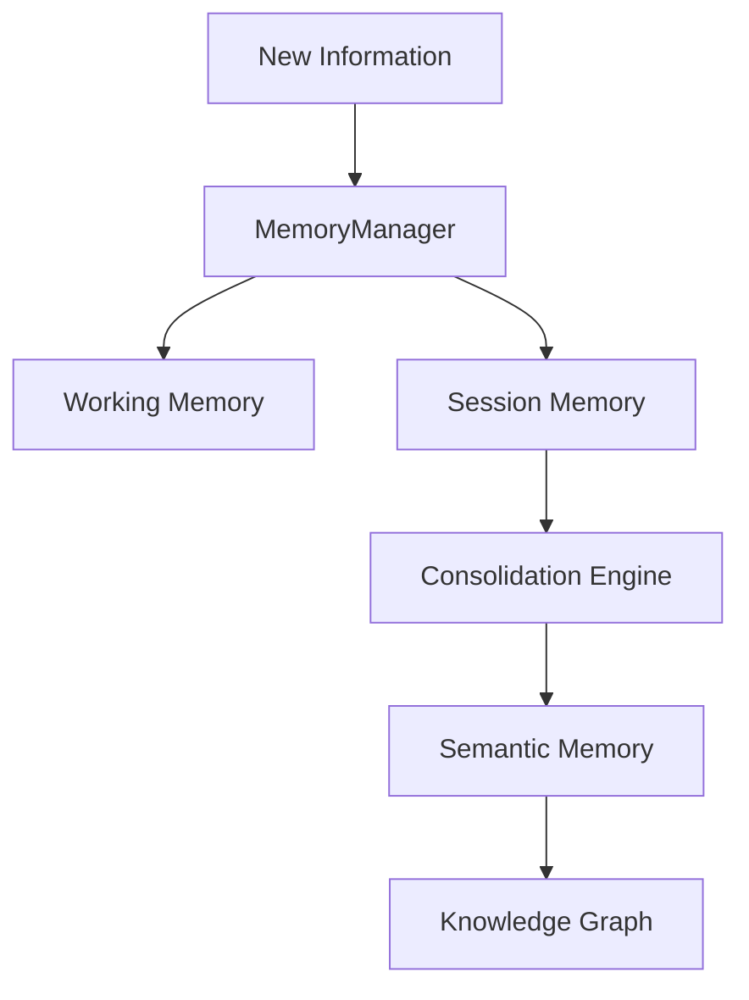
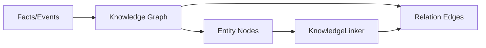
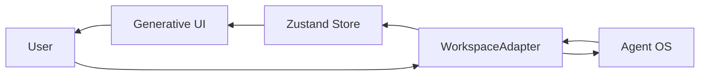
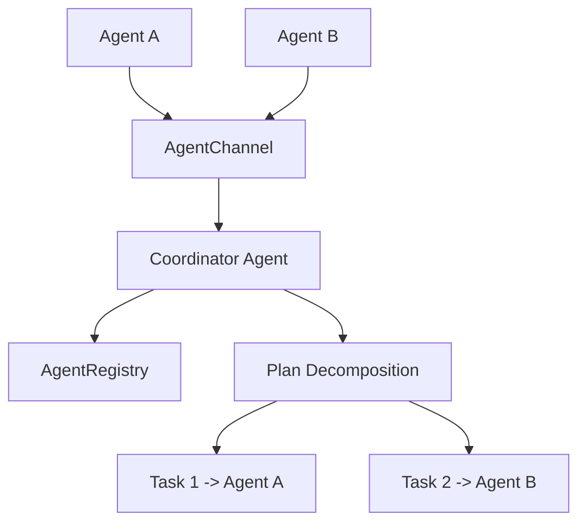
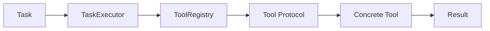
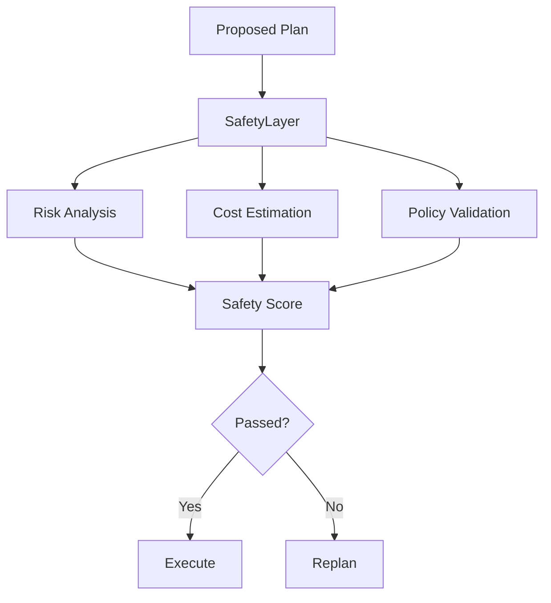
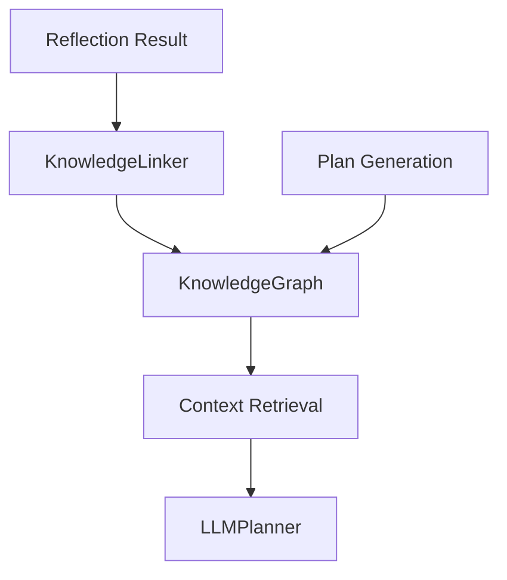

# Architecture Snapshot - Nexus Agent OS

## 1. System Overview
The Nexus Agent OS is a production-grade autonomous agent framework built with TypeScript/React. It features a multi-layered architecture designed for reliability, observability, and scalability.

## 2. Architecture Layers

### Executive Layer
- **ExecutiveBrain**: Orchestrates high-level goals and missions.
- **GoalManager**: Manages the lifecycle of mission goals.
- **PriorityManager**: Handles mission prioritization.
- **MissionScheduler**: Schedules mission execution.

### Coordination Layer
- **CoordinatorAgent**: Coordinates multi-agent collaboration and task delegation.
- **PlannerCoordinator**: Manages plan decomposition across agents.
- **PlannerConsensus**: Resolves consensus among agents for shared plans.
- **AgentRegistry**: maintains a registry of available agents.

### Runtime Layer
- **AgentRuntime**: The core execution environment for an agent.
- **EventBus / UnifiedEventBus**: System-wide reactive communication.
- **AgentStream**: Provides observable thought and execution streams.
- **AgentChannel**: Handles inter-agent communication.

### Reasoning Layer
- **LLMPlanner**: Generates autonomous plans using LLMs.
- **PlannerParser**: Parses LLM outputs into structured plans.
- **PlanValidator**: Ensures plans meet structural and tool requirements.
- **SafetyGuard**: Evaluates plans for risk, cost, and policy violations.

### Execution Layer
- **WorkflowEngine**: Executes plans as a graph of tasks.
- **TaskExecutor**: Maps tasks to specific tool executions.
- **ToolRegistry**: Manages available tools and their protocols.

### Intelligence Layer
- **ReflectionEngine**: Analyzes completed workflows for lessons and improvements.
- **ExecutionAnalyzer**: Processes execution events for reflection.
- **ImprovementEngine**: Generates optimization recommendations.
- **PerformanceMonitor**: Tracks system metrics and latency.

### Memory & Knowledge Layer
- **MemoryManager**: Orchestrates working, session, and long-term memory.
- **PersistentMemory**: Long-term storage for thoughts and facts.
- **KnowledgeGraph**: Entity-relationship graph for structured knowledge.
- **VectorSearch**: (Placeholder/Future) Semantic search capabilities.

---

## 3. Core Flows

### Execution Flow

### Planning Flow

### Reflection Flow

### Memory Flow

### Knowledge Flow

### Workspace Flow

### Agent Collaboration Flow

### Tool Execution Flow

### Safety Flow

### Knowledge Graph Flow

---

## 4. Component Audit Findings

| Module | Status | Observations |
| :--- | :--- | :--- |
| Agent Runtime | ✅ Healthy | Central orchestrator, well-defined lifecycle. |
| Executive Brain | ✅ Healthy | Handles mission scheduling and goals effectively. |
| Coordinator Agent | ✅ Healthy | Good multi-agent support and consensus logic. |
| Planner | ✅ Healthy | Robust parsing and validation. |
| Workflow Engine | ✅ Healthy | Graph-based parallel execution works as intended. |
| Reflection Engine | ✅ Healthy | Links improvements back to memory and improvement engine. |
| Knowledge Graph | ✅ Healthy | In-memory implementation is efficient for current scale. |
| Memory Layer | ✅ Healthy | Multi-tier memory (working, session, semantic) is solid. |
| Safety Layer | ✅ Healthy | covers risk, cost, and policies. |
| Workspace Adapter | ✅ Healthy | Clean bridge between Agent core and React frontend. |

## 5. Discovered Issues & Recommendations

### Issues Found during Audit:
1. **Circular Dependency**: `AgentRuntime` and `SelfCorrection` have a direct circular dependency.
   - *Impact*: Low, handled by TypeScript/JavaScript runtime, but poor for long-term maintainability.
   - *Recommendation*: Introduce an interface for the runtime or use an event-based callback for self-correction.
2. **Linting - Unexpected any**: Found `any` usage in `ThoughtProtocol.test.ts` and `WorkflowEngine.test.ts`.
   - *Status*: **FIXED** during Phase 8.1.
3. **Linting - Unused Variable**: `Thought` type imported but unused in `ThoughtProtocol.test.ts`.
   - *Status*: **FIXED** during Phase 8.1.
4. **Large File**: `AgentRuntime.ts` (~14.5KB) is becoming large.
   - *Recommendation*: Consider moving reflection and self-improvement logic into dedicated sub-orchestrators if it grows further.

### Overall Assessment:
The repository is in excellent condition. The architecture is coherent, type safety is strong (after fixes), and the system shows high modularity and resilience.

**Certification Status: Phase 8.1 Audit PASSED**
