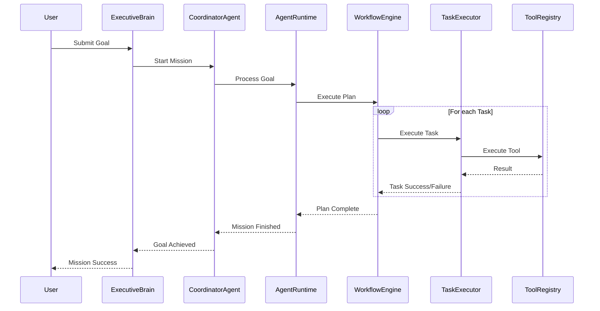
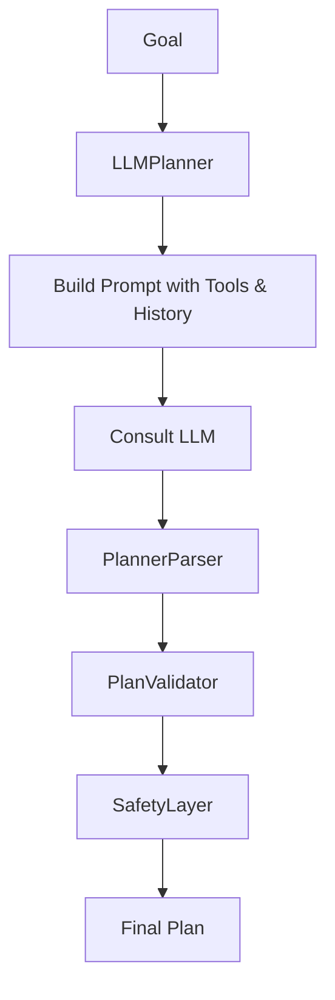
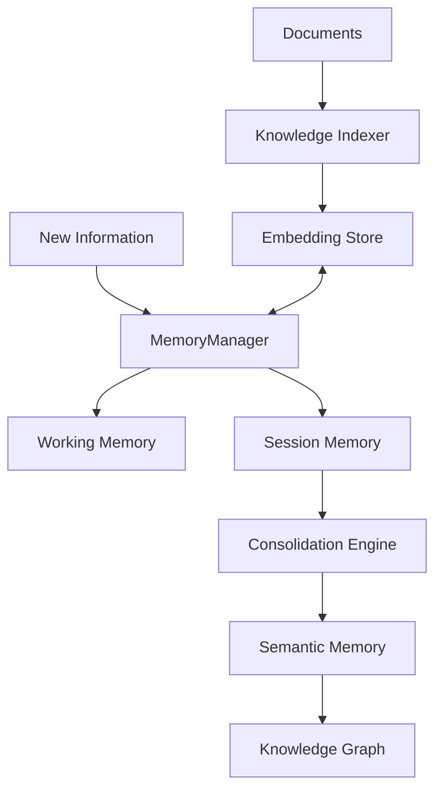

# Nexus Agent OS — Architecture Snapshot (Phase 8.1)

## 1. Executive Summary
The Nexus Agent OS is a modular, event-driven agentic framework built with TypeScript and React. It features a sophisticated cognitive pipeline encompassing Planning, Execution, Reflection, and Self-Improvement. The system is designed for autonomy, resilience, and observability.

## 2. Architecture Layers

### Executive Layer
- **ExecutiveBrain**: Orchestrates high-level goals and missions.
- **GoalManager**: Manages the lifecycle of mission goals.
- **PriorityManager**: Handles mission prioritization.
- **MissionScheduler**: Schedules mission execution.

### Coordination Layer
- **CoordinatorAgent**: Coordinates multi-agent collaboration and task delegation.
- **PlannerCoordinator**: Manages plan decomposition across agents.
- **PlannerConsensus**: Resolves consensus among agents for shared plans.
- **AgentRegistry**: Maintains a registry of available agents.

### Runtime Layer
- **AgentRuntime**: The central brain that orchestrates the lifecycle of a mission. It maintains agent state, dispatches actions, and connects cognitive engines.
- **EventBus**: A high-performance internal communication hub using the Pub/Sub pattern to ensure loose coupling between modules.
- **SelfCorrection**: An autonomous monitoring system that handles failures and triggers recovery cycles (re-planning).
- **AgentStream**: Provides observable thought and execution streams.

### Cognitive & Reasoning Layer
- **LLMPlanner**: Generates autonomous plans using LLMs.
- **PlannerParser**: Parses LLM outputs into structured plans.
- **PlanValidator**: Ensures plans meet structural and tool requirements.
- **WorkflowEngine**: A state-machine-based execution engine that manages task transitions and parallel execution.

### Execution Layer
- **TaskExecutor**: The bridge between abstract tasks and concrete tool calls, handling parameter mapping and result normalization.
- **ToolRegistry**: A centralized repository of discoverable capabilities with standardized schemas.

### Intelligence & Reflection Layer
- **ReflectionEngine**: Performs post-mission analysis to identify lessons learned, mistakes, and potential improvements.
- **ExecutionAnalyzer**: Processes execution events for reflection.
- **ImprovementEngine**: Translates reflection insights into actionable suggestions for the Planner and Executor.
- **PerformanceMonitor**: Tracks system metrics and latency.

### Knowledge & Memory Layer
- **MemoryManager**: Orchestrates working, session, and long-term memory.
- **PersistentMemory**: Long-term storage for thoughts and facts.
- **KnowledgeDatabase / KnowledgeGraph**: Entity-relationship graph and RAG system for structured knowledge.
- **VectorSearch**: Semantic search integration for document retrieval.

---

## 3. System Flows

### 3.1 Overall Execution Flow

### 3.2 Planning Flow

### 3.3 Reflection & Improvement Loop

### 3.4 Memory & Knowledge Flow

---

## 4. Module Integrity Audit

| Module | Purpose | Integrity Status | Notes |
| :--- | :--- | :--- | :--- |
| **Agent Runtime** | Orchestration | **Warning** | Circular dependency with SelfCorrection. Large file (~250 LOC). |
| **Executive Brain** | Management | **Healthy** | Handles mission scheduling and goals effectively. |
| **Coordinator Agent** | Collaboration | **Healthy** | Good multi-agent support and consensus logic. |
| **Planner** | Planning | **Redundant** | Duplicate prompt logic in StructuredPlanner. LLMPlanner is robust. |
| **Workflow Engine** | Execution | **Healthy** | Graph-based parallel execution works as intended. |
| **Reflection Engine** | Intelligence | **Disconnected** | FailureAnalyzer/SuccessAnalyzer implemented but not integrated. |
| **Knowledge Graph** | Knowledge | **Healthy** | In-memory implementation is efficient. |
| **Memory Layer** | Storage | **Healthy** | Multi-tier memory (working, session, persistent) is solid. |
| **Safety Layer** | Validation | **Baseline** | Covers risk, cost, and policies. |
| **Workspace** | UI Integration | **Healthy** | Clean bridge between core and React frontend. |

---

## 5. Identified Issues & Technical Debt

### 5.1 Critical Issues
1. **Circular Dependency**: `AgentRuntime.ts` <-> `SelfCorrection.ts` creates potential initialization risks and complicates testing.
2. **Type Safety**: Multiple `Unexpected any` in core files (`WorkflowEngine`, `ToolRegistry`, `SessionMemory`) bypasses TS benefits.
3. **Build Stability**: A TS error in `PlanImprover.ts` was fixed during Phase 8.1.

### 5.2 Technical Debt
1. **Redundant Logic**: `StructuredPlanner.ts` is partially redundant with `LLMPlanner.ts`.
2. **Disconnected Modules**: `FailureAnalyzer` and `SuccessAnalyzer` are implemented but not integrated into the `ReflectionEngine`.
3. **UI Impurity**: Impure functions (`Math.random()`) and synchronous `setState` in effects in multiple UI components (`sidebar.tsx`, `carousel.tsx`, `use-mobile.ts`, `Workspace.tsx`).

### 5.3 Code Quality
- **Lint Errors**: 89 lint errors across the project (mostly `any`, `unused-vars`, `react-refresh` violations).
- **Dead Code**: Several unused interfaces and imports identified by linting.

**Certification Status: Phase 8.1 Audit IN PROGRESS (Findings Documented)**
