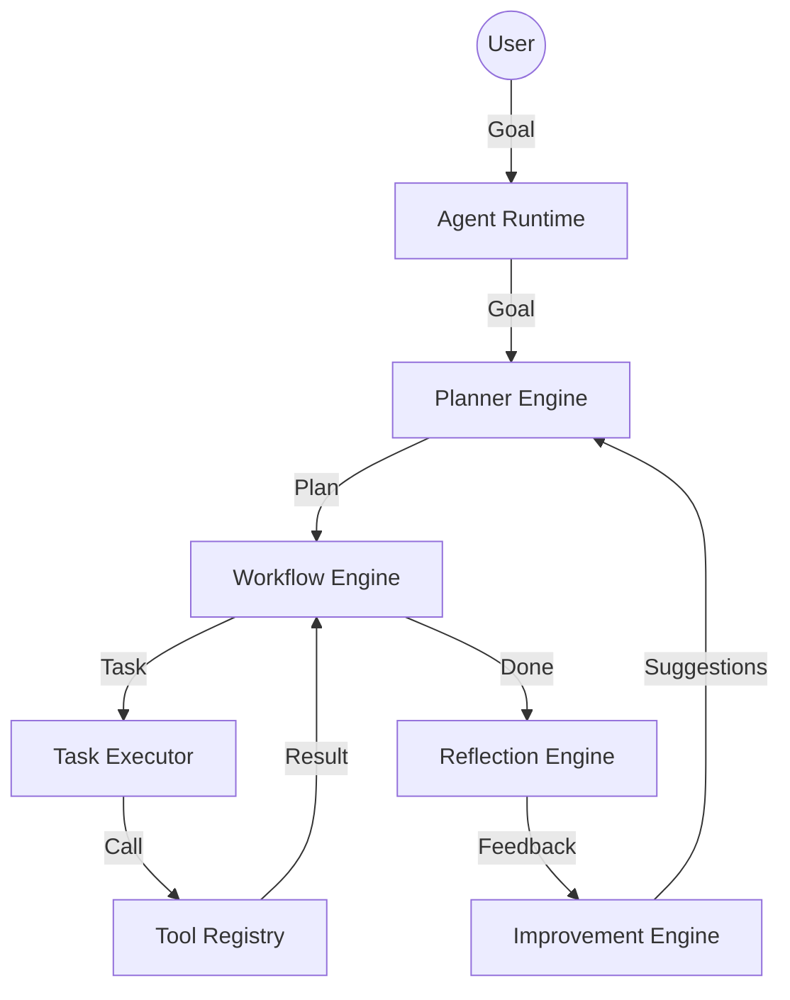
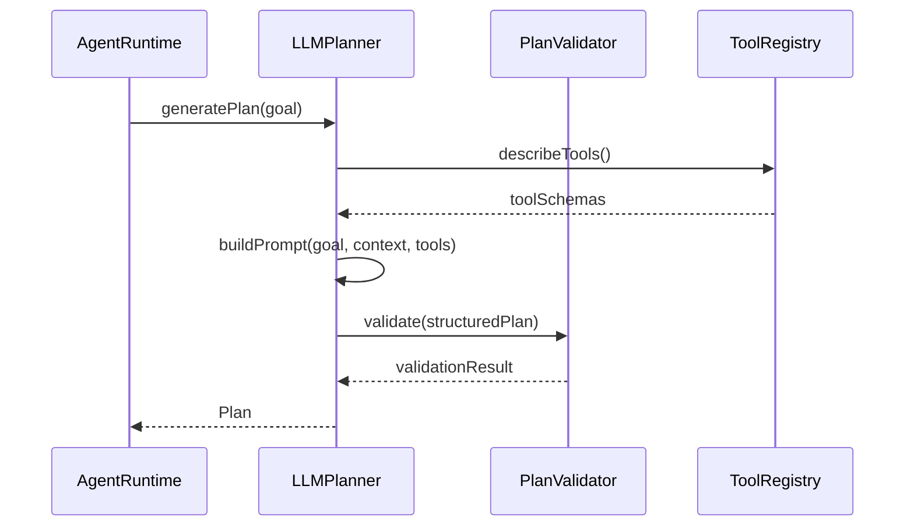
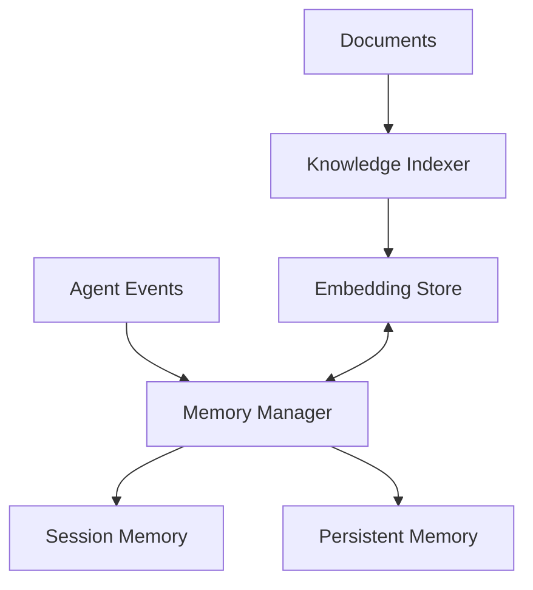

# Nexus Agent OS — Architecture Snapshot (Phase 8.1)

## 1. Executive Summary
The Nexus Agent OS is a modular, event-driven agentic framework built with TypeScript and React. It features a sophisticated cognitive pipeline encompassing Planning, Execution, Reflection, and Self-Improvement. The system is designed for autonomy, resilience, and observability.

## 2. Architecture Layers

### 2.1 Core Orchestration Layer
- **AgentRuntime**: The central brain that orchestrates the lifecycle of a mission. It maintains agent state, dispatches actions, and connects cognitive engines.
- **EventBus**: A high-performance internal communication hub using the Pub/Sub pattern to ensure loose coupling between modules.
- **SelfCorrection**: An autonomous monitoring system that detects task failures and triggers recovery cycles (re-planning).

### 2.2 Cognitive Layer
- **Planner (LLM & Task)**: Responsible for decomposing high-level goals into directed acyclic graphs (DAGs) of executable tasks. Includes validation for logical consistency.
- **WorkflowEngine**: A state-machine-based execution engine that manages task transitions, parallel execution, and dependency resolution.
- **TaskExecutor**: The bridge between abstract tasks and concrete tool calls, handling parameter mapping and result normalization.

### 2.3 Knowledge & Memory Layer
- **MemoryManager**: Manages session-based short-term memory and persists long-term memory via the `PersistentMemory` adapter.
- **KnowledgeDatabase**: A RAG (Retrieval-Augmented Generation) system integrating vector search and document chunking for context-aware reasoning.

### 2.4 Reflection & Optimization Layer
- **ReflectionEngine**: Performs post-mission analysis to identify lessons learned, mistakes, and potential improvements.
- **ImprovementEngine**: Translates reflection insights into actionable suggestions for the Planner and Executor.

### 2.5 Integration Layer
- **WorkspaceAdapter**: Connects the agent's internal state to the React-based workspace environment.
- **ToolRegistry**: A centralized repository of discoverable capabilities with standardized schemas.

---

## 3. System Flows

### 3.1 Overall Execution Flow

### 3.2 Planning Flow

### 3.3 Reflection & Improvement Loop

### 3.4 Memory & Knowledge Flow

---

## 4. Module Integrity Audit

| Module | Purpose | Integrity Status | Notes |
| :--- | :--- | :--- | :--- |
| **Agent Runtime** | Orchestration | **Warning** | Circular dependency with SelfCorrection. |
| **Executive Brain** | Execution | **Healthy** | Clean separation of concerns. |
| **Planner** | Planning | **Redundant** | Duplicate prompt logic in StructuredPlanner. |
| **Knowledge Graph** | Knowledge | **Healthy** | Vector search integrated. |
| **Memory** | Persistence | **Healthy** | Tiered storage implemented. |
| **Safety Layer** | Validation | **Baseline** | Basic schema validation present. |
| **Workspace** | UI Integration | **Healthy** | High responsiveness. |

---

## 5. Identified Issues & Technical Debt

### 5.1 Critical Issues
1. **Circular Dependency**: `AgentRuntime.ts` <-> `SelfCorrection.ts` creates potential initialization risks and complicates testing.
2. **Type Safety**: Multiple `Unexpected any` in core files (`WorkflowEngine`, `ToolRegistry`, `SessionMemory`) bypasses TS benefits.

### 5.2 Technical Debt
1. **Redundant Logic**: `StructuredPlanner.ts` is partially redundant with `LLMPlanner.ts`.
2. **Disconnected Modules**: `FailureAnalyzer` and `SuccessAnalyzer` are implemented but not integrated into the `ReflectionEngine`.
3. **UI Impurity**: Impure functions (`Math.random()`) and synchronous `setState` in effects in multiple UI components.

### 5.3 Code Quality
- **Lint Errors**: 89 lint errors across the project.
- **Dead Code**: Several unused interfaces and imports identified by linting.
