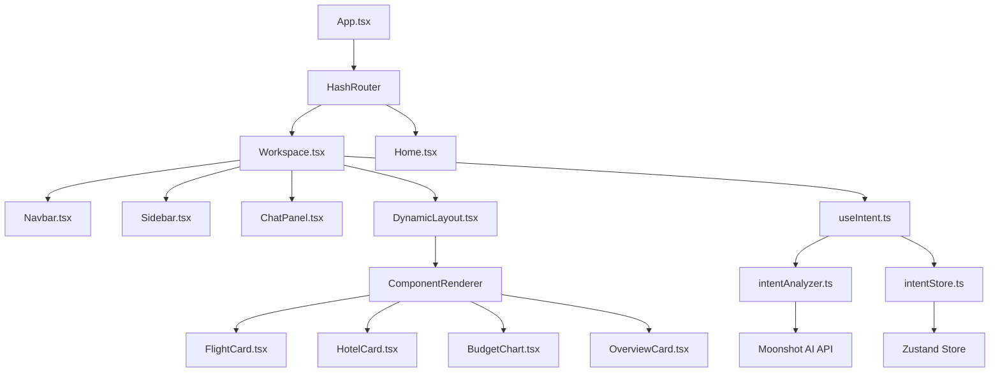

# Nexus to Agent OS — Migration Map

## 1. Overview
This document outlines the strategic transformation of the **Nexus** intent-driven UI system into the **Agent OS** architecture. Agent OS is a modular, kernel-driven framework designed for autonomous agents and generative user interfaces.

---

## 2. Current Dependency Graph

---

## 3. Migration Decisions Key
| Decision | Description |
| :--- | :--- |
| **Keep** | Move to Agent OS with minimal changes to core logic. |
| **Refactor** | Rewrite to align with Agent OS's modular/plugin-based patterns. |
| **Move** | Relocate to a new directory that better reflects its role in the new architecture. |
| **Replace** | Supersede with a standard Agent OS primitive or a more scalable abstraction. |

---

## 4. Detailed File Map

### 4.1 Hooks (`src/hooks`)
| File Path | Responsibility | Dependencies | Decision | Future Location (Agent OS) |
| :--- | :--- | :--- | :--- | :--- |
| `useIntent.ts` | Intent orchestration & local generation | `intentAnalyzer.ts`, `intentStore.ts` | **Refactor** | `kernel/cortex/intent-engine/` |
| `use-mobile.ts` | Viewport responsive detection | None | **Keep** | `shell/hooks/use-responsive.ts` |
| `useParticles.ts` | Background visual effects logic | None | **Keep** | `shell/hooks/use-effects.ts` |

### 4.2 Libraries (`src/lib`)
| File Path | Responsibility | Dependencies | Decision | Future Location (Agent OS) |
| :--- | :--- | :--- | :--- | :--- |
| `agents/intentAnalyzer.ts` | LLM API Communication | Moonshot API | **Refactor** | `kernel/adapters/llm-provider.ts` |
| `types/intent.ts` | Domain model & schema | None | **Move** | `kernel/schema/intent-schema.ts` |
| `utils.ts` | Style & UI helper functions | `tailwind-merge`, `clsx` | **Keep** | `shared/lib/utils.ts` |

### 4.3 Components (`src/components`)
| File Path | Responsibility | Dependencies | Decision | Future Location (Agent OS) |
| :--- | :--- | :--- | :--- | :--- |
| `generative-ui/DynamicLayout.tsx` | Component orchestration & grid | `ComponentRenderer` | **Refactor** | `registry/layout-engine/` |
| `generative-ui/ChatPanel.tsx` | Assistant interface | `useIntent.ts` | **Refactor** | `shell/components/comms/chat/` |
| `layout/Navbar.tsx` | Global navigation | `userStore.ts` | **Move** | `shell/layout/navigation/` |
| `layout/Sidebar.tsx` | Contextual modules & logs | `logStore.ts` | **Refactor** | `shell/layout/sidebar/` |
| `ui/*` | Atomic UI primitives | Radix UI | **Keep** | `shared/ui/atoms/` |

### 4.4 Stores (`src/stores`)
| File Path | Responsibility | Dependencies | Decision | Future Location (Agent OS) |
| :--- | :--- | :--- | :--- | :--- |
| `intentStore.ts` | Active intent state | Zustand | **Replace** | `kernel/store/active-intent.ts` |
| `userStore.ts` | Session & History management | Zustand | **Move** | `kernel/store/user-context.ts` |
| `logStore.ts` | System diagnostic logs | Zustand | **Move** | `system/diagnostics/event-logger.ts` |

### 4.5 Pages (`src/pages`)
| File Path | Responsibility | Dependencies | Decision | Future Location (Agent OS) |
| :--- | :--- | :--- | :--- | :--- |
| `Home.tsx` | Application entry / Landing | Framer Motion | **Keep** | `shell/pages/landing/` |
| `Workspace.tsx` | Core Operating Environment | All Kernel/Shell parts | **Refactor** | `shell/pages/desktop/` |

---

## 5. Critical Files
1.  **`useIntent.ts`**: This is the heart of the system. In Agent OS, this must be decoupled from specific UI component generation and moved into a "Kernel" service that emits data-only intent packets.
2.  **`intentAnalyzer.ts`**: Currently tightly coupled to Moonshot AI. Must be refactored into a provider-agnostic adapter to support Gemini and OpenAI.
3.  **`DynamicLayout.tsx`**: The main rendering engine. Needs to be transformed into a Registry-based system where new modules can be registered dynamically.

---

## 6. Migration Order
1.  **Phase 1: Shared Core**: Migrate `types`, `utils`, and atomic `ui` components to the `shared/` directory.
2.  **Phase 2: Kernel Protocol**: Establish the `kernel/` directory with `llm-provider` adapters and unified `store` management.
3.  **Phase 3: Intent Cortex**: Migrate and refactor `useIntent` into the Kernel, ensuring it communicates via state updates rather than direct component injection.
4.  **Phase 4: Shell Construction**: Build the new `shell/` structure (Navbar, Sidebar, ChatPanel) and hook them into the Kernel.
5.  **Phase 5: Component Registry**: Move generated UI cards (Flight, Hotel, etc.) into a central Registry that the `DynamicLayout` consumes.

---

## 7. Risky Areas
-   **State Management Hydration**: Moving from multiple Zustand stores to a unified Kernel memory might cause state synchronization issues during the transition.
-   **API Abstraction**: Decoupling from Moonshot's specific JSON output format might require a translation layer to maintain compatibility with existing cards.
-   **Layout Scalability**: The 12-column grid in `DynamicLayout` is robust but rigid; Agent OS needs to support more fluid, container-relative positioning.
-   **Performance**: The heavy use of `framer-motion` and `gsap` needs careful coordination within the Kernel-Shell event loop to avoid frame drops.
