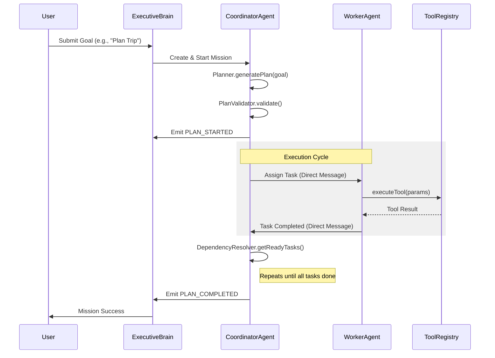

# Nexus Agent OS — Mission Lifecycle Flow

## 1. Mission Decomposition and Execution
A mission follows a structured lifecycle from high-level goal to verified achievement.

## 2. Recovery Scenarios
- **Task Failure**: Coordinator triggers automatic retry (up to 3 times).
- **Persistent Failure**: Coordinator triggers `replan` (up to 2 times).
- **Mission Failure**: ExecutiveBrain triggers mission retry (incremental backoff).

## 3. Parallelism
Tasks without dependencies are executed in parallel by the `WorkflowEngine` and `PlannerCoordinator`, maximizing throughput and reducing overall mission latency.
