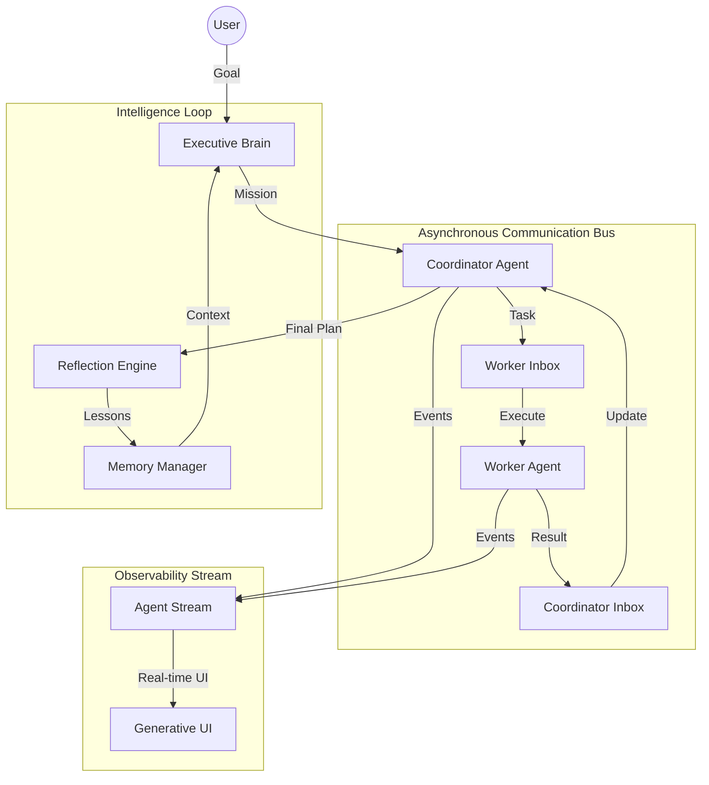

# Nexus Agent OS — System Flow

## 1. High-Level Event Flow
The system operates on an event-driven architecture powered by a Unified Event Bus. Communication between agents is strictly asynchronous to prevent synchronous recursion and ensure scalability.

## 2. Component Interaction
1. **ExecutiveBrain**: Acts as the mission controller, managing goal priorities and scheduling.
2. **CoordinatorAgent**: The lead architect for a specific mission, responsible for planning and delegation.
3. **AgentRuntime**: The execution engine for a specific agent role (worker or coordinator).
4. **ToolRegistry**: The capabilities provider, housing all executable tools.
5. **MemoryManager**: The knowledge repository, handling episodic (session) and semantic (long-term) memory.

## 3. Communication Protocol
- **Direct Messaging**: Target-specific messages (TASK_ASSIGNMENT, TASK_COMPLETED).
- **Pub/Sub Events**: Global state updates (AGENT_UPDATE, REFLECTION).
- **Wildcard Matching**: Allows components to listen to namespaces (agent.*) or specific event types.
