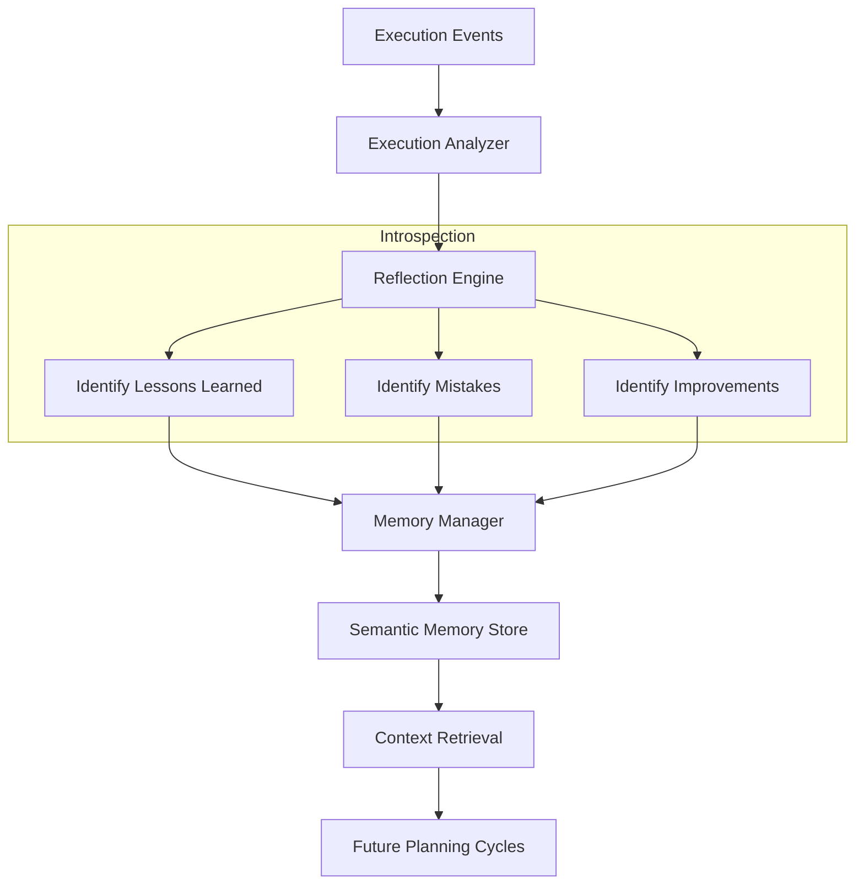

# Nexus Agent OS — Thought Flow (Intelligence Loop)

## 1. The Cognitive Cycle
The "Intelligence Loop" ensures that every execution informs future decisions through the Reflection and Memory layers.

## 2. Memory Tiering
- **Working Memory**: Transient state for the current task (status, parameters).
- **Session Memory**: Episodic log of the current mission (all events).
- **Semantic Memory**: Consolidated insights and facts persisted across missions.

## 3. Self-Improvement
The `ImprovementEngine` monitors system performance (latency, success rates) and provides optimization recommendations. These recommendations can dynamically adjust agent behavior, such as increasing retry limits for non-deterministic tools or suggesting plan refinements.
